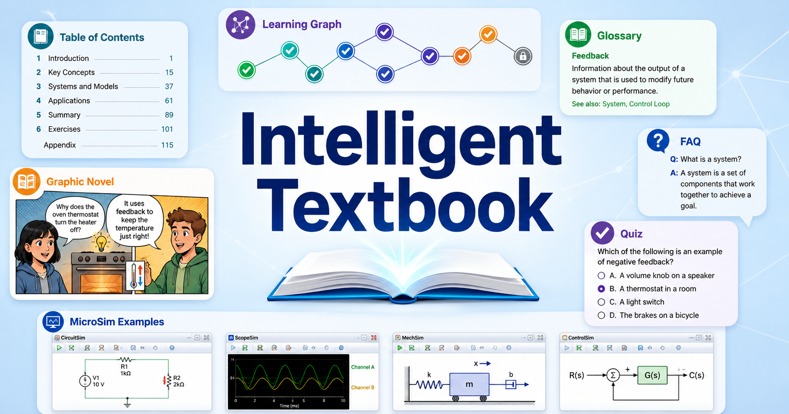

# {{SITE_NAME}}

<figure markdown>
  { width="100%" }
</figure>

{{SITE_DESCRIPTION}}

## Getting Started

This is an intelligent textbook built with MkDocs Material. Use the navigation
sidebar on the left to explore chapters, the learning graph, MicroSims, and
supporting reference content.

## Front Matter

- **About** — audience, prerequisites, and how to read the book
- **Course Description** — the seed document used to generate the learning graph

## Chapters

The main body of the book lives under [Chapters](chapters/index.md). Each
chapter has its own folder with a two-digit prefix (e.g. `01-introduction`).

## Learning Graph

The [Learning Graph](learning-graph/index.md) shows how concepts depend on each
other. Concepts are introduced in dependency order so prerequisites are always
covered before they are used.

## MicroSims

Interactive simulations live under [MicroSims](sims/index.md). Each MicroSim
focuses on one concept and is embeddable as an iframe inside chapter content.
